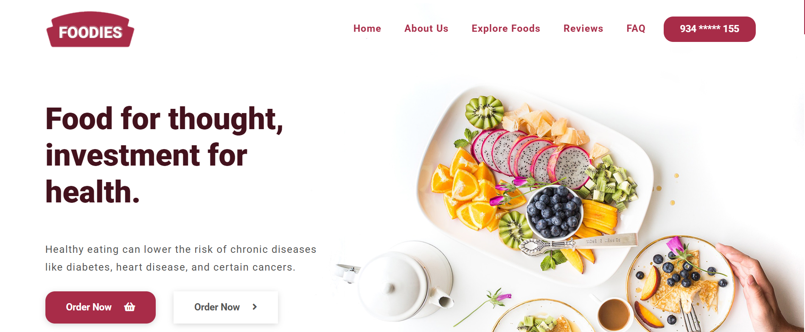

# Chowdaiah Foodies 🍔

A modern and fully responsive **Food Ordering Website** built with pure HTML, CSS & JavaScript.



## ✨ Features

- Responsive design (Mobile + Desktop)
- Browse food categories and items
- Add to Cart functionality
- Search food items
- Smooth animations and modern UI
- Fully functional cart system

## 🛠️ Technologies Used

- **HTML5**
- **CSS3**
- **JavaScript (ES6+)**
- Responsive Design

## 📸 Screenshots

<div align="center">
  
  
  
</div>

## 🚀 How to Run Locally

1. Clone the repository
```bash
git clone https://github.com/chowdaiahgorige/chowdaiah-foodies.git
